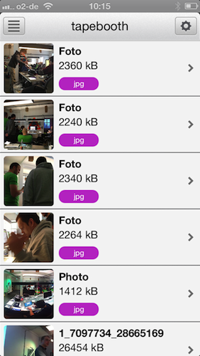
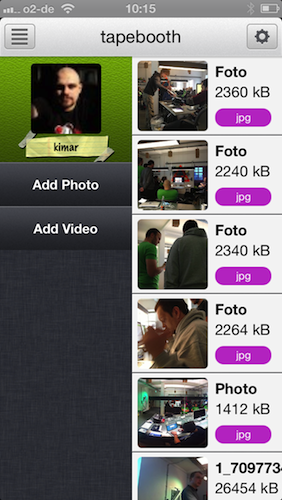
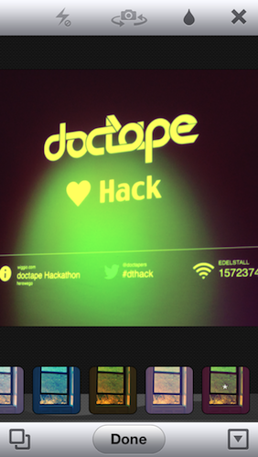

**tapebooth**

This iOS App is designed to connect to the public [doctape](http://doctape.com) OAuth2 API in order to retrieve documents stored in their cloud filesystem.
The User should then be able to manipulate Images and post at Social Networks.
This App has been created from Jan 18th to Jan 20th in 2013 as part of the @doctapers HACKATHON #dthack

Many thanks go to [MediaLoot](http://medialoot.com) for their free iOS GUI Template.

